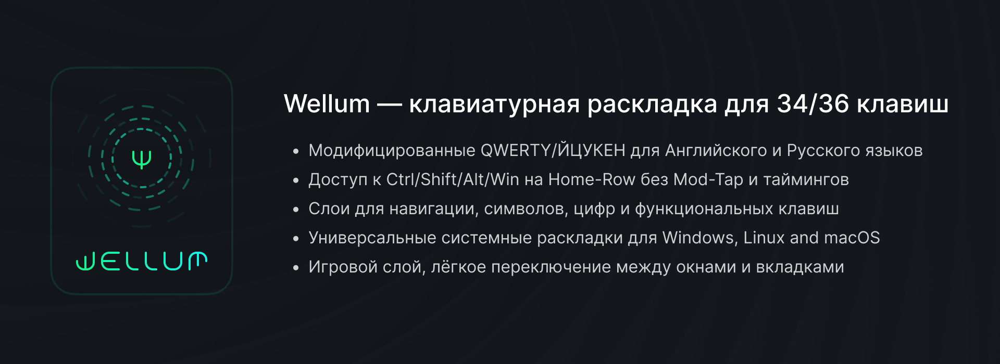

# Wellum — клавиатурная раскладка для 34/36 клавиш

## Содержание

- [О прошивке](#о-прошивке)
- [Термины](#термины)
- [Раскладки](#раскладки)
- Дополнительно
  - [Как работают One-shot Sticky Modifiers](#как-работают-one-shot-sticky-modifiers)
  - [Как работает Swapper и Tabber](#как-работает-swapper-и-tabber)
- [Как установить?](#как-установить)
- [Как сделать LAYOUT\_split\_3x5\_2 или LAYOUT\_split\_3x5\_3?](./guides/как-сделать-layout-split-3x5.md)
- [История изменений](#история-изменений)

## О прошивке

Прошивка/раскладка предназначена для использования с [Universal Layout](https://github.com/braindefender/universal-layout) — системной раскладкой для Windows, Linux и macOS. На странице проекта можно найти все необходимые инструкции по установке и модификации этой раскладки.

Прошивка/раскладка основана на [callum](https://github.com/callum-oakley/qmk_firmware/tree/master/users/callum).
Версия `firmware/qmk` работает на [QMK](https://docs.qmk.fm/) и предназначена для проводных клавиатур.
Версия `firmware/zmk` работает на [ZMK](https://zmk.dev/docs) и предназначена для беспроводных клавиатур.

## Термины

- Модификатор: <kbd>Shift</kbd>, <kbd>Ctrl</kbd>, <kbd>Alt</kbd> или <kbd>Gui</kbd>
- Клавиши слоя: <kbd>SYM</kbd> или <kbd>NAV</kbd>
- Смена языка: <kbd>LANG</kbd> на базовом слое (или на слое NAV, для версии с 34 клавишами)

## Раскладки

| Кол-во клавиш | Раскладка                     |
| ------------: | :---------------------------- |
|            34 | [Wellum 34](./for-34-keys.md) |
|            36 | [Wellum 36](./for-36-keys.md) |

## Как работают One-shot Sticky Modifiers

При зажатии клавиш слоя, нажатые модификаторы добавляются в очередь и остаются нажатыми, пока не будет нажата клавиша не-модификатор или клавиша слоя.

К примеру, чтобы нажать клавишу Windows <kbd>Gui</kbd> без каких-либо комбинаций, вам нужно:

- зажать клавишу слоя
- нажать модификатор <kbd>Gui</kbd>
- отпустить клавишу слоя и нажать её ещё раз.

А если вам нужно, к примеру, нажать комбинацию <kbd>Ctrl</kbd>+<kbd>Shift</kbd>+<kbd>T</kbd>, то для этого у вас есть несколько вариантов:

1. Первый:
   - Вы зажимаете клавишу слоя <kbd>SYM</kbd>
   - Набираете модификаторы <kbd>K (Ctrl)</kbd> and <kbd>J (Shift)</kbd> в любой последовательности
   - Отпускаете клавишу слоя <kbd>SYM</kbd>
   - Нажимаете <kbd>T</kbd>
2. Второй:
   - Вы зажимаете клавишу слоя <kbd>NAV</kbd>
   - Набираете модификаторы <kbd>D (Ctrl)</kbd> and <kbd>F (Shift)</kbd> в любой последовательности
   - Отпускаете клавишу слоя <kbd>NAV</kbd>
   - Нажимаете <kbd>T</kbd>

Как только будет нажата клавиша <kbd>T</kbd>, очередь из модификаторов сработает, очистится и введётся комбинация <kbd>Ctrl</kbd>+<kbd>Shift</kbd>+<kbd>T</kbd>.

Более того, зажав клавиши-модификаторы, но отпустив клавишу слоя, модификаторы останутся зажатыми, что позволит использовать их в комбинациях клавишами другой половинки.

> В версии для ZMK также реализовано следующее: при повторном нажатии на клавишу модификатора, он сразу же сработает и не добавится в очередь. Это, например, позволяет вызвать меню пуска с помощью NAV+A+A, что превратится в LGui.

## Как работает Swapper и Tabber

Клавиши Swapper <kbd>NAV+W</kbd> и Tabber <kbd>NAV+Q</kbd> – это специальные макросы для <kbd>Alt+Tab</kbd> и <kbd>Ctrl+Tab</kbd> соответственно. Однако при нажатии они оставляют зажатыми модификаторы <kbd>Alt</kbd> и <kbd>Ctrl</kbd> соответственно.

Таким образом, повторно нажимая W и Q можно переключаться по окнам в Windows, вкладкам в Веб-браузере или Терминале.

Эти клавиши совместимы с модификатором <kbd>Shift</kbd>, что позволяет инвертировать направление переключения по окнам/вкладкам.

## Как установить?

Здесь всё зависит от вашей клавиатуры. Если вы не знаете с чего начать, то изучите инструкцию о том, [как адаптировать раскладку под свою клавитуру?](./guides/как-адаптировать-раскладку-под-мою-клавиатуру.md)

Для некоторых клавиатур существуют билды прошивки (могут быть добавлены пользователями посредством Pull Request'ов). Можете поискать свою клавиатуру в папке `prebuilts`.

- Первое, что понадобится сделать — установить [Universal Layout](https://github.com/braindefender/universal-layout) для вашей операционной системы.

### QMK

Для сборки прошивки понадобится актуальная версия [QMK](https://github.com/qmk/qmk_firmware/).

- Скопировать содержимое папки `firmware` в папку `<ваша_клавиатура>/keymaps/wellum`
- Сделать билд и прошивку стандартной командой сборки/прошивки под вашу клавиатуру, указав вариант `:wellum`.
- Если для вашей клавиатуры не определёны `LAYOUT_split_3x5_2` или `LAYOUT_split_3x5_3` в `info.json` вам нужно сделать их самим. Инструкция ниже.

### ZMK

Для сборки прошивки понадобится аккаунт на GitHub. Можно взять за основу репозиторий для вашей клавиатуры или вот этот [репозиторий с донглом](https://github.com/aroum/zmk-enki42-dongle), а затем адаптировать его, применив содержимое папки `firmware/zmk/wellum36` (или `wellum34` для версии с 34 клавишами).

## История изменений

v3.1
- Исправлены ошибки и замечания (спасибо [@pravets](https://github.com/pravets))
- Прошивки для QMK и ZMK приведены к единому виду
- Обновлены изображения раскладок

v3.0
- Добавлена версия для беспроводных клавиатур на прошивке ZMK
- Положения клавиш <kbd>W</kbd> и <kbd>S</kbd> возвращены к изначальным, т.к. плохо показали себя в играх.
- Для ZMK, в игровой слой `GFN` добавлены клавиши управления Bluetooth устройством.

v2.0
- Добавлена раскладка для 34-клавиш.
- Добавлен слой CMD, содержащий медиа-клавиши и макросы.
- ALT слой выделен в отдельный слой на клавиатуре, что даёт большую кастомизируемость этого слоя.
- На игровом слое изменены положения клавиш <kbd>W</kbd> и <kbd>S</kbd> для более эргономичного положения пальцев.

v1.0
- Первый релиз
