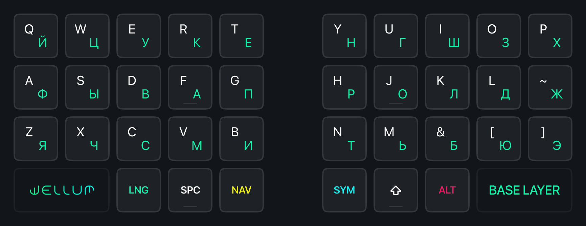

# Wellum — клавиатурная раскладка для 34/36 клавиш



## Содержание

- [О прошивке](#о-прошивке)
- [Термины](#термины)
- [Раскладки](#раскладки)
- Дополнительно
  - [Как работают One-shot Sticky Modifiers](#как-работают-one-shot-sticky-modifiers)
  - [Как работает Swapper и Tabber](#как-работает-swapper-и-tabber)
- [Как установить?](#как-установить)
- [Как сделать LAYOUT\_split\_3x5\_2 или LAYOUT\_split\_3x5\_3?](#как-сделать-layout_split_3x5_2-или-layout_split_3x5_3)
- [История изменений](#история-изменений)

## О прошивке

Прошивка/раскладка предназначена для использования с [Universal Layout](https://github.com/braindefender/universal-layout) — системной раскладкой для Windows, Linux и macOS. На странице проекта можно найти все необходимые инструкции по установке и модификации этой раскладки.

Прошивка/раскладка основана на [callum](https://github.com/callum-oakley/qmk_firmware/tree/master/users/callum) и работает на [QMK](https://docs.qmk.fm/), предназначенном для проводных клавиатур. Версия для беспроводных клавиатур, работающих на [ZMK](https://zmk.dev/docs) находится в разработке.

## Термины

- Модификатор: <kbd>Shift</kbd>, <kbd>Ctrl</kbd>, <kbd>Alt</kbd> или <kbd>Gui</kbd>
- Клавиши слоя: <kbd>SYM</kbd> или <kbd>NAV</kbd>
- Смена языка: <kbd>LANG</kbd> на слое NAV

## Раскладки

| Кол-во клавиш | Раскладка                     |
| ------------: | :---------------------------- |
|            34 | [Wellum 34](./for-34-keys.md) |
|            36 | [Wellum 36](./for-36-keys.md) |

## Как работают One-shot Sticky Modifiers

При зажатии клавиш слоя, нажатые модификаторы добавляются в очередь и остаются нажатыми, пока не будет нажата клавиша не-модификатор или клавиша слоя.

К примеру, чтобы нажать клавишу Windows <kbd>Gui</kbd> без каких-либо комбинаций, вам нужно:

- зажать клавишу слоя
- нажать модификатор <kbd>Gui</kbd>
- отпустить клавишу слоя и нажать её ещё раз.

А если вам нужно, к примеру, нажать комбинацию <kbd>Ctrl</kbd>+<kbd>Shift</kbd>+<kbd>T</kbd>, то для этого у вас есть несколько вариантов:

1. Первый:
   - Вы зажимаете клавишу слоя <kbd>SYM</kbd>
   - Набираете модификаторы <kbd>K (Ctrl)</kbd> and <kbd>J (Shift)</kbd> в любой последовательности
   - Отпускаете клавишу слоя <kbd>SYM</kbd>
   - Нажимаете <kbd>T</kbd>
2. Второй:
   - Вы зажимаете клавишу слоя <kbd>NAV</kbd>
   - Набираете модификаторы <kbd>D (Ctrl)</kbd> and <kbd>F (Shift)</kbd> в любой последовательности
   - Отпускаете клавишу слоя <kbd>NAV</kbd>
   - Нажимаете <kbd>T</kbd>

Как только будет нажата клавиша <kbd>T</kbd>, очередь из модификаторов сработает, очистится и введётся комбинация <kbd>Ctrl</kbd>+<kbd>Shift</kbd>+<kbd>T</kbd>.

Более того, зажав клавиши-модификаторы, но отпустив клавишу слоя, модификаторы останутся зажатыми, что позволит использовать их в комбинациях клавишами другой половинки.

## Как работает Swapper и Tabber

Клавиши Swapper <kbd>NAV+W</kbd> и Tabber <kbd>NAV+Q</kbd> – это специальные макросы для <kbd>Alt+Tab</kbd> и <kbd>Ctrl+Tab</kbd> соответственно. Однако при нажатии они оставляют зажатыми модификаторы <kbd>Alt</kbd> и <kbd>Ctrl</kbd> соответственно.

Таким образом, повторно нажимая W и Q можно переключаться по окнам в Windows, вкладкам в Веб-браузере или Терминале.

Эти клавиши совместимы с модификатором <kbd>Shift</kbd>, что позволяет инвертировать направление переключения по окнам/вкладкам.

## Как установить?

Здесь всё зависит от вашей клавиатуры. Если вы не знаете с чего начать, то изучите инструкцию о том, [как адаптировать раскладку под свою клавитуру?](./guides/как-адаптировать-раскладку-под-мою-клавиатуру.md)

Для некоторых клавиатур существуют билды прошивки (добавляются пользователями посредством Pull Request'ов). Можете поискать свою клавиатуру в папке `prebuilts`.

Для сборки прошивки понадобится актуальная версия [QMK](https://github.com/qmk/qmk_firmware/).

- Скопировать содержимое папки `firmware` в папку `<ваша_клавиатура>/keymaps/wellum`
- Сделать билд и прошивку стандартной командой сборки/прошивки под вашу клавиатуру, указав вариант `:wellum`.
- Если для вашей клавиатуры не определёны `LAYOUT_split_3x5_2` или `LAYOUT_split_3x5_3` в `info.json` вам нужно сделать их самим. Инструкция ниже.
- Установить [Universal Layout](https://github.com/braindefender/universal-layout) для вашей операционной системы.

## Как сделать LAYOUT_split_3x5_2 или LAYOUT_split_3x5_3?

`keymap.c` опирается на  `LAYOUT_split_3x5_2` для wellum34 и `LAYOUT_split_3x5_3` для wellum36 соответственно.

Для большинства клавиатур он может быть не определён. Чтобы это исправить нужно продублировать ваш текущий `LAYOUT_split_***_*`, после чего вычистить оттуда клавиши, не попадающие в новую сетку.

К примеру, для `LAYOUT_split_3x6_3` нужно убрать строки, соответствующие крайним левым и крайним правым столбцам.
Для `LAYOUT_split_3x6_2` также понадобится убрать элементы, соответствующие клавишам для большого пальца.

Всего, в массиве `layout` должно остаться ровно **34 элемента** для wellum34 и **36 элементов** для wellum36.

<details>
  <summary>Пример</summary>

  ```jsonc
  "LAYOUT_split_3x6_3": {
    "layout": [
      { "matrix": [0, 0], "x": 0, "y": 0.25 },  // крайний левый, удалить
      { "matrix": [0, 1], "x": 1, "y": 0.25 },
      { "matrix": [0, 2], "x": 2, "y": 0.125 },
      { "matrix": [0, 3], "x": 3, "y": 0 },
      { "matrix": [0, 4], "x": 4, "y": 0.125 },
      { "matrix": [0, 5], "x": 5, "y": 0.25 },
      { "matrix": [4, 0], "x": 8, "y": 0.25 },
      { "matrix": [4, 1], "x": 9, "y": 0.125 },
      { "matrix": [4, 2], "x": 10, "y": 0 },
      { "matrix": [4, 3], "x": 11, "y": 0.125 },
      { "matrix": [4, 4], "x": 12, "y": 0.25 },
      { "matrix": [4, 5], "x": 13, "y": 0.25 }, // крайний правый, удалить
      { "matrix": [1, 0], "x": 0, "y": 1.25 },  // крайний левый, удалить
      { "matrix": [1, 1], "x": 1, "y": 1.25 },
      { "matrix": [1, 2], "x": 2, "y": 1.125 },
      { "matrix": [1, 3], "x": 3, "y": 1 },
      { "matrix": [1, 4], "x": 4, "y": 1.125 },
      { "matrix": [1, 5], "x": 5, "y": 1.25 },
      { "matrix": [5, 0], "x": 8, "y": 1.25 },
      { "matrix": [5, 1], "x": 9, "y": 1.125 },
      { "matrix": [5, 2], "x": 10, "y": 1 },
      { "matrix": [5, 3], "x": 11, "y": 1.125 },
      { "matrix": [5, 4], "x": 12, "y": 1.25 },
      { "matrix": [5, 5], "x": 13, "y": 1.25 }, // крайний правый, удалить
      { "matrix": [2, 0], "x": 0, "y": 2.25 },  // крайний левый, удалить
      { "matrix": [2, 1], "x": 1, "y": 2.25 },
      { "matrix": [2, 2], "x": 2, "y": 2.125 },
      { "matrix": [2, 3], "x": 3, "y": 2 },
      { "matrix": [2, 4], "x": 4, "y": 2.125 },
      { "matrix": [2, 5], "x": 5, "y": 2.25 },
      { "matrix": [6, 0], "x": 8, "y": 2.25 },
      { "matrix": [6, 1], "x": 9, "y": 2.125 },
      { "matrix": [6, 2], "x": 10, "y": 2 },
      { "matrix": [6, 3], "x": 11, "y": 2.125 },
      { "matrix": [6, 4], "x": 12, "y": 2.25 },
      { "matrix": [6, 5], "x": 13, "y": 2.25 }, // крайний правый, удалить
      { "matrix": [3, 0], "x": 3.5, "y": 3.25 },
      { "matrix": [3, 1], "x": 4.5, "y": 3.5 },
      { "matrix": [3, 2], "x": 5.5, "y": 3.75 },
      { "matrix": [7, 0], "x": 7.5, "y": 3.75 },
      { "matrix": [7, 1], "x": 8.5, "y": 3.5 },
      { "matrix": [7, 2], "x": 9.5, "y": 3.25 }
    ]
  }
  ```
</details>

## История изменений

v2.0
- Добавлена раскладка для 34-клавиш.
- Добавлен слой CMD, содержащий медиа-клавиши и макросы.
- ALT слой выделен в отдельный слой на клавиатуре, что даёт большую кастомизируемость этого слоя.
- На игровом слое изменены положения клавиш <kbd>W</kbd> и <kbd>S</kbd> для более эргономичного положения пальцев.

v1.0
- Первичный релиз
