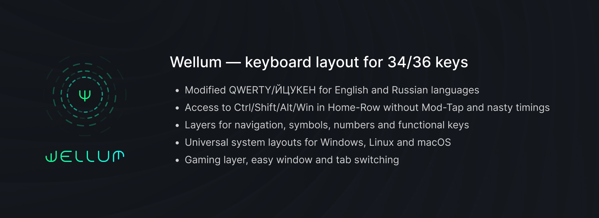
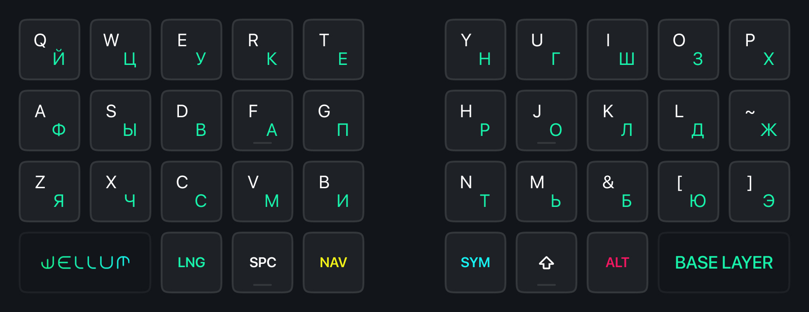

> Этот файл также доступен на [русском языке](./README.md).

# Wellum — keyboard layout for 34/36 Keys

## Table of Contents

- [About the Firmware](#about-the-firmware)
- [Terms](#terms)
- [Layouts](#layouts)
- Additional
  - [How One-Shot Sticky Modifiers Work](#how-one-shot-sticky-modifiers-work)
  - [How Swapper and Tabber Work](#how-swapper-and-tabber-work)
- [How to install?](#how-to-install)
- [Changelog](#changelog)

## About the Firmware

The firmware/layout is designed for use with [Universal Layout](https://github.com/braindefender/universal-layout) — a system layout for Windows, Linux, and macOS. On the project page, you can find all necessary instructions for installing and modifying this layout.

The firmware/layout is based on [callum](https://github.com/callum-oakley/qmk_firmware/tree/master/users/callum).

The `firmware/qmk` version runs on [QMK](https://docs.qmk.fm/) and is intended for wired keyboards. 
The `firmware/zmk` version runs on [ZMK](https://zmk.dev/docs) and is intended for wireless keyboards.

## Terms

- Modifier: <kbd>Shift</kbd>, <kbd>Ctrl</kbd>, <kbd>Alt</kbd>, or <kbd>Gui</kbd>
- Layer Keys: <kbd>SYM</kbd>, <kbd>NAV</kbd>, <kbd>ALT</kbd>, <kbd>CMD</kbd>
- Language Switch: <kbd>LANG</kbd> on the base layer (or on the <kbd>NAV</kbd> layer for the 34-key version)

> The `LANG` key is essentially a Caps Lock key. In the Universal Layout system layout, Caps Lock switches between internal EN and RU layers. At the same time, no system language/layout switching occurs!

## Layouts

| Number of Keys | Layout                        |
| -------------: | :---------------------------- |
|             34 | [Wellum 34](./for-34-keys.md) |
|             36 | [Wellum 36](./for-36-keys.md) |

## How One-shot Sticky Modifiers Work

When holding layer keys, pressed modifiers are added to the queue and remain pressed until a non-modifier key or a layer key is pressed.

For example, to press the Windows <kbd>Gui</kbd> key without any combinations, you need to:

- Hold the layer key
- Press the modifier <kbd>Gui</kbd>
- Release the layer key and tap it again.

And if you need, for example, to press the combination <kbd>Ctrl</kbd>+<kbd>Shift</kbd>+<kbd>T</kbd>, you have several options:

1. First:
   - You hold the layer key <kbd>SYM</kbd>
   - Type the modifiers <kbd>K (Ctrl)</kbd> and <kbd>J (Shift)</kbd> in any order
   - Release the layer key <kbd>SYM</kbd>
   - Press <kbd>T</kbd>
2. Second:
   - You hold the layer key <kbd>NAV</kbd>
   - Type the modifiers <kbd>D (Ctrl)</kbd> and <kbd>F (Shift)</kbd> in any order
   - Release the layer key <kbd>NAV</kbd>
   - Press <kbd>T</kbd>

As soon as <kbd>T</kbd> is pressed, the modifier queue will trigger, clear, and input the combination <kbd>Ctrl</kbd>+<kbd>Shift</kbd>+<kbd>T</kbd> will be sent to the system.

Moreover, by holding the modifier keys but releasing the layer key, the modifiers will remain held, allowing you to use them in combinations with keys from the other half.

> In the ZMK version, the following is also implemented: upon pressing a modifier key again, it immediately triggers and is not added to the queue. This, for example, allows calling the Start Menu with just NAV+A+A, which turns into LGui.

## How Swapper and Tabber Work

The Swapper <kbd>NAV+W</kbd> and Tabber <kbd>NAV+Q</kbd> keys are special macros for <kbd>Alt+Tab</kbd> and <kbd>Ctrl+Tab</kbd> respectively. However, when pressed, they leave the <kbd>Alt</kbd> and <kbd>Ctrl</kbd> modifiers held until layer key is held.

Thus, by repeatedly pressing W and Q, you can switch between windows in Windows, tabs in a web browser or terminal.

These keys are compatible with the <kbd>Shift</kbd> modifier, which allows inverting the switching direction for windows/tabs.

## How to Install?

Everything depends on your keyboard. If you don't know where to start, study the instruction on [how to adapt the layout to your keyboard?](./guides/guides_en/how-to-adapt-layout-for-my-keyboard.md)

For some keyboards, firmware builds exist (may be added by users via Pull Requests). You can search for your keyboard in the `prebuilts` folder.

- First, you need to install [Universal Layout](https://github.com/braindefender/universal-layout) for your operating system.

### QMK

To build the firmware, you will need the current version of [QMK](https://github.com/qmk/qmk_firmware/).

- Copy the contents of the `firmware` folder to `<your_keyboard>/keymaps/wellum`
- Build and flash using the standard build/flash command for your keyboard, specifying the `:wellum` variant.
- If `LAYOUT_split_3x5_2` or `LAYOUT_split_3x5_3` are not defined in `info.json` for your keyboard, you need to make them yourself, following [this instruction](./guides/guides_en/how-to-make-layout-split-3x5.md).

### ZMK

To build the firmware, you will need a GitHub account. You can take a repository for your keyboard as a basis or this [repository with a dongle](https://github.com/aroum/zmk-enki42-dongle), and then adapt it by applying the contents of the `firmware/zmk/wellum36` folder (or `wellum34` for the 34-key version).

## Changelog

v3.1.1
- Added English readme and guides.

v3.1
- Fixed bugs and comments (thanks [@pravets](https://github.com/pravets))
- QMK and ZMK firmware brought to a unified form
- Updated layout images

v3.0
- Added version for wireless keyboards on ZMK firmware
- Positions of <kbd>W</kbd> and <kbd>S</kbd> keys returned to original, as they performed poorly in games.
- For ZMK, Bluetooth device control keys added to the game layer `GFN`.

v2.0
- Added layout for 34 keys.
- Added CMD layer containing media keys and macros.
- ALT layer separated into a separate layer on the keyboard, providing greater customizability of this layer.
- On the game layer, positions of <kbd>W</kbd> and <kbd>S</kbd> keys changed for more ergonomic finger positioning.

v1.0
- First release
