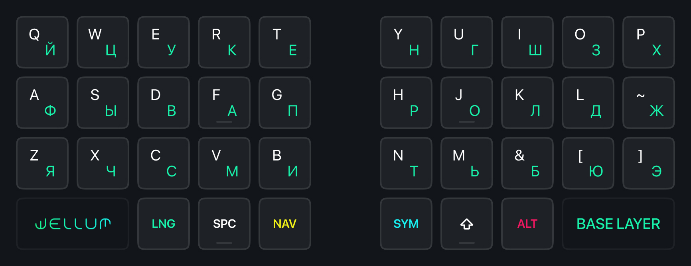
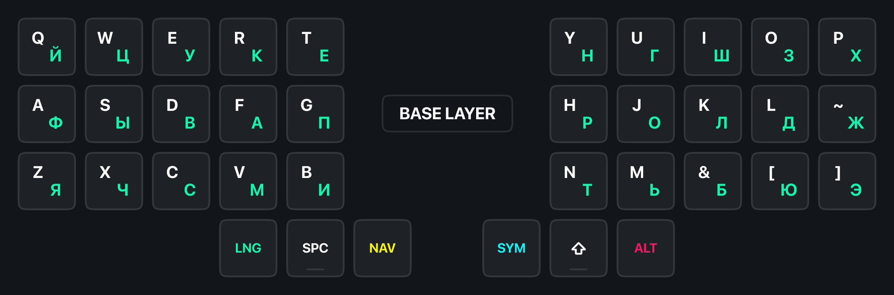
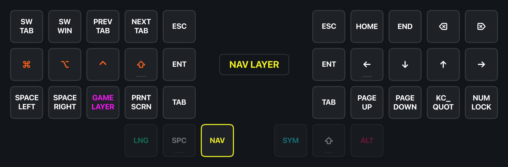
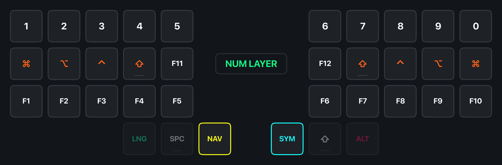
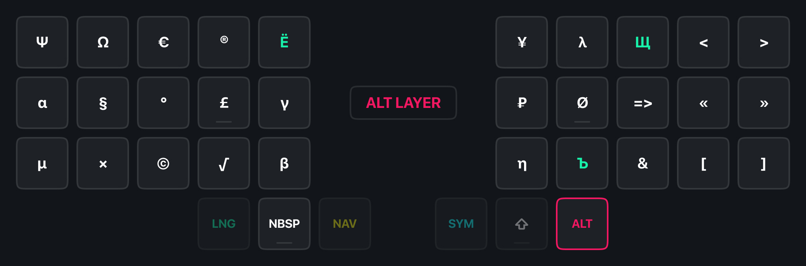
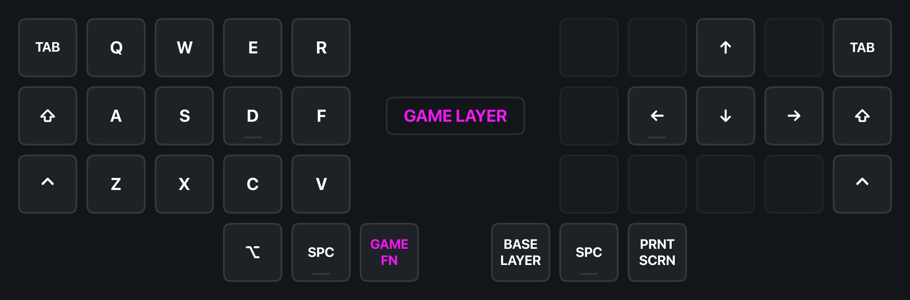
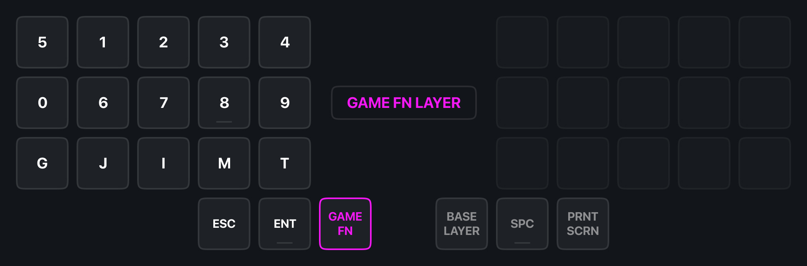

# Wellum — клавиатурная раскладка для 36 клавиш

[This article is also available in 🇬🇧 English language.](README.md)

## Содержание

- [О прошивке](#о-раскладке)
- [Термины](#термины)
- [Клавиатурные слои](#клавиатурные-слои)
  - [Базовый слой](#базовый-слой)
  - [Символы](#символы)
  - [Навигация](#навигация)
  - [Цифры и F-клавиши](#цифры-и-f-клавиши)
  - [Специальные символы](#специальные-символы)
  - [Игровой слой](#игровой-слой)
- Дополнительно
  - [Как работают One-shot Sticky Modifiers](#как-работают-one-shot-sticky-modifiers)
  - [Как работает Swapper и Tabber](#как-работает-swapper-и-tabber)
- [Как установить](#как-установить)

## О прошивке

Прошивка/раскладка предназначена для использования с [Universal Layout](https://github.com/braindefender/universal-layout) — системной раскладкой для Windows, Linux и macOS. На странице проекта можно найти все необходимые инструкции по установке и модификации этой раскладки.

Прошивка/раскладка основана на [callum](https://github.com/callum-oakley/qmk_firmware/tree/master/users/callum) и работает на [QMK](https://docs.qmk.fm/), предназначенном для проводных клавиатур. Версия для беспроводных клавиатур, работающих на [ZMK](https://zmk.dev/docs) находится в разработке.

## Термины

- Модификатор: <kbd>Shift</kbd>, <kbd>Ctrl</kbd>, <kbd>Alt</kbd> или <kbd>Gui</kbd>
- Клавиши слоя: <kbd>SYM</kbd> или <kbd>NAV</kbd>

## Клавиатурные слои

- Удерживайте <kbd>SYM</kbd> чтобы активировать слой символов.
- Удерживайте <kbd>NAV</kbd> чтобы активировать слой навигации.
- Удерживайте <kbd>SYM</kbd> и <kbd>NAV</kbd> вместе, чтобы активировать слой с цифрами.
- Удерживайте <kbd>ALT</kbd> чтобы активировать слой спец. символов.

## Базовый слой

> [!NOTE]
> Не волнуйтесь! Буквы `Ё`, `Ъ` и `Щ` находятся в [ALT слое](#специальные-символы).

## Символы

## Навигация

На левой половинке расположены <kbd>Game Layer</kbd>, <kbd>Print Screen</kbd> и различные макросы:

|                Клавиша | Макрос                                                                        |
| ---------------------: | ----------------------------------------------------------------------------- |
|      <kbd>SW TAB</kbd> | [Swapper](#как-работает-swapper-и-tabber) (для окон в Windows/Linux)          |
|      <kbd>SW WIN</kbd> | [Tabber](#как-работает-swapper-и-tabber) (для вкладок в браузере и терминале) |
|    <kbd>PREV TAB</kbd> | <kbd>Ctrl</kbd> + <kbd>Shift</kbd> + <kbd>Tab</kbd>                           |
|    <kbd>NEXT TAB</kbd> | <kbd>Ctrl</kbd> + <kbd>Tab</kbd>                                              |
|  <kbd>SPACE LEFT</kbd> | <kbd>Ctrl</kbd> + <kbd>Gui</kbd> + <kbd>Left</kbd>                            |
| <kbd>SPACE RIGHT</kbd> | <kbd>Ctrl</kbd> + <kbd>Gui</kbd> + <kbd>Right</kbd>                           |

На правой половинке расположены vim-подобные стрелочки, Home/End (сверху) и Page Up/Down (снизу).

Клавиши <kbd>Escape</kbd>, <kbd>Enter</kbd> и <kbd>Tab</kbd> продублированы на обеих половинках, что удобно при в различных программах и редакторах, где только левая рука находится на клавиатуре, а правая держит мышь.

## Цифры и F-клавиши

## Специальные символы

В слой вынесены русские буквы, которые не влезли в 2×15 сетку, а также различные символы, многие из которых расположены мнемонически:

|       Символ | Способ ввода                  |
| -----------: | ----------------------------- |
| <kbd>Ё</kbd> | <kbd>Alt</kbd> + <kbd>Е</kbd> |
| <kbd>Ъ</kbd> | <kbd>Alt</kbd> + <kbd>Ь</kbd> |
| <kbd>Щ</kbd> | <kbd>Alt</kbd> + <kbd>Ш</kbd> |
| <kbd>₽</kbd> | <kbd>Alt</kbd> + <kbd>Р</kbd> |

На месте **пробела** расположен символ **неразрывного пробела**, который заставляет делать перенос текста только вместе с соседними от него словами.

В ALT слое также доступны `<` `>` `«` `»` `[` `]` (доступные для обеих языков) и лигатура `=>`, удобная для разработчиков.

## Игровой слой

WASD смещён на одну колонку вправо, чтобы вместить <kbd>Tab</kbd>, <kbd>Shift</kbd> и <kbd>Ctrl</kbd> на почти привычных позициях. Для эргономичных клавиатур это также актуально из-за смещения клавиш по вертикали, где клавиша под средний палец находится выше всего.

Также, в слое с цифрами помещается два ряда цифр и часто используемые в играх клавиши:

|      Клавиша | Описание  |
| -----------: | --------- |
| <kbd>G</kbd> | Grenade   |
| <kbd>J</kbd> | Journal   |
| <kbd>I</kbd> | Inventory |
| <kbd>M</kbd> | Map       |
| <kbd>T</kbd> | Chat      |

## Как работают One-shot Sticky Modifiers.

При зажатии клавиш слоя, нажатые модификаторы добавляются в очередь и остаются нажатыми, пока не будет нажата клавиша не-модификатор или клавиша слоя.

К примеру, чтобы нажать клавишу Windows <kbd>Gui</kbd> без каких-либо комбинаций, вам нужно:

- зажать клавишу слоя
- нажать модификатор <kbd>Gui</kbd>
- отпустить клавишу слоя и нажать её ещё раз.

А если вам нужно, к примеру, нажать комбинацию Ctrl+Shift+T, то для этого у вас есть несколько вариантов:

1. Первый:
   - Вы зажимаете клавишу слоя <kbd>SYM</kbd>
   - Набираете модификаторы <kbd>K (Ctrl)</kbd> and <kbd>J (Shift)</kbd> в любой последовательности
   - Отпускаете клавишу слоя <kbd>SYM</kbd>
   - Вводите <kbd>T</kbd>
2. Второй:
   - Вы зажимаете клавишу слоя <kbd>NAV</kbd>
   - Набираете модификаторы <kbd>D (Ctrl)</kbd> and <kbd>F (Shift)</kbd> в любой последовательности
   - Отпускаете клавишу слоя <kbd>NAV</kbd>
   - Вводите <kbd>T</kbd>

Как только будет нажата клавиша <kbd>T</kbd>, очередь из модификаторов сработает, очистится и введётся комбинация <kbd>Ctrl+Shift+T</kbd>.

Более того, зажав клавиши-модификаторы, но отпустив клавишу слоя, модификаторы останутся зажатыми, что позволит использовать их в комбинациях клавишами другой половинки.

## Как работает Swapper и Tabber.

Клавиши Swapper <kbd>NAV+W</kbd> и Tabber <kbd>NAV+Q</kbd> – это макросы для <kbd>Alt+Tab</kbd> и <kbd>Ctrl+Tab</kbd> соответственно. Однако при нажатии они оставляют зажатыми модификаторы <kbd>Alt</kbd> и <kbd>Ctrl</kbd> соответственно.

Таким образом, повторно нажимая W и Q можно переключаться по окнам в Windows, вкладкам в Веб-браузере или Терминале.

Эти клавиши совместимы с модификатором <kbd>Shift</kbd>, что позволяет инвертировать направление переключения по окнам/вкладкам.

## Как установить

Для сборки прошивки понадобится актуальная версия [QMK](https://github.com/qmk/qmk_firmware/).

- Скопировать содержимое папки `firmware` в папку `<ваша_клавиатура>/keymaps/wellum`
- Сделать билд и прошивку стандартной командой сборки/прошивки под вашу клавиатуру, указав вариант `:wellum`.
- Установить [Universal Layout](https://github.com/braindefender/universal-layout) для вашей операционной системы.
