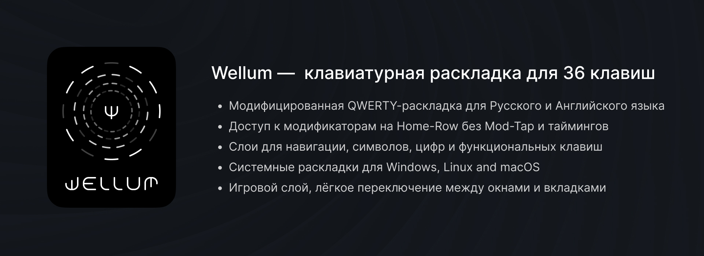
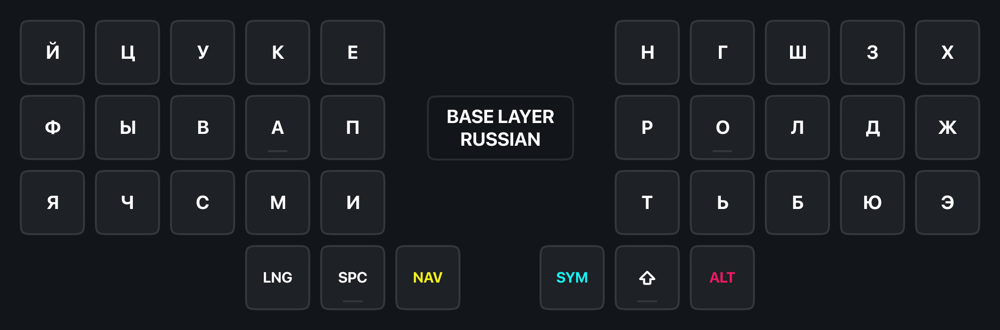
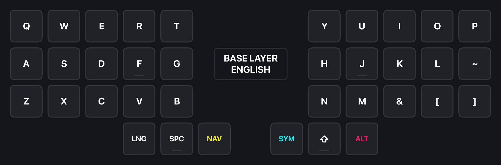
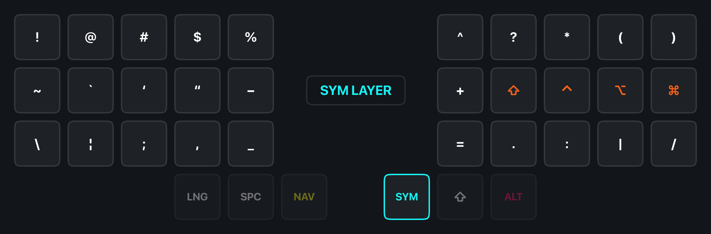
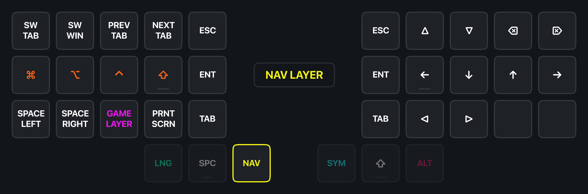
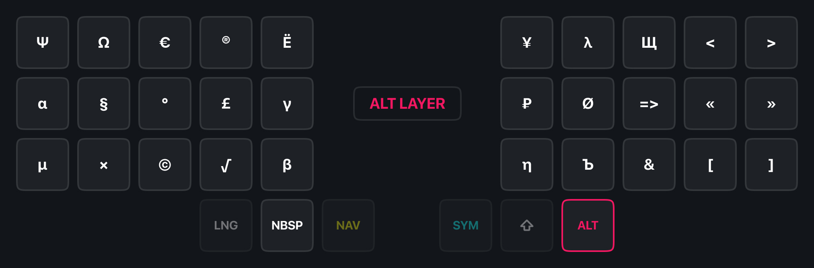
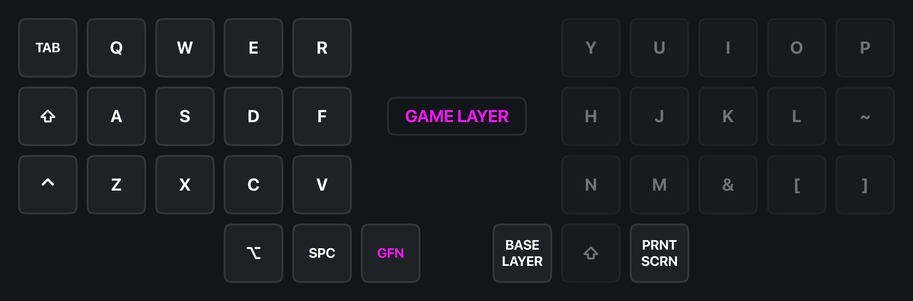
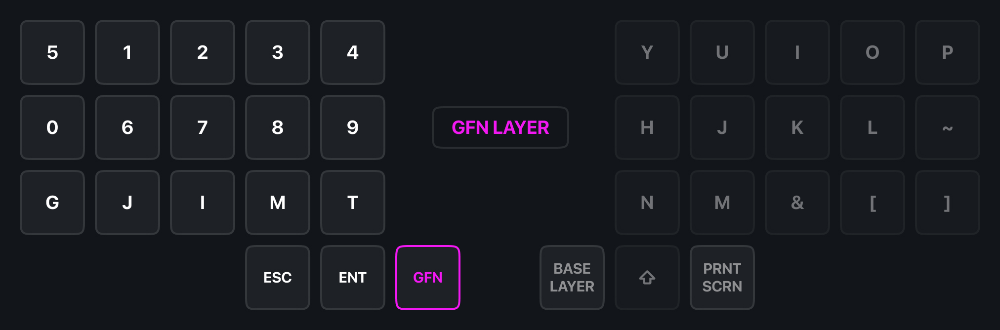

# Wellum — клавиатурная раскладка для 36 клавиш

[This article is also available in 🇬🇧 English language.](README.md)

## Термины

- Модификатор: <kbd>Shift</kbd>, <kbd>Ctrl</kbd>, <kbd>Alt</kbd> или <kbd>Gui</kbd>
- Клавиши слоя: <kbd>SYM</kbd> or <kbd>NAV</kbd>

## Подробности

- Удерживайте <kbd>SYM</kbd> чтобы активировать слой символов.
- Удерживайте <kbd>NAV</kbd> чтобы активировать слой навигации.
- Удерживайте <kbd>SYM</kbd> и <kbd>NAV</kbd> вместе, чтобы активировать слой с цифрами.
- Удерживайте <kbd>ALT</kbd> чтобы активировать слой спец. символов.

## Клавиатурные слои

### Базовый слой

> Не волнуйтесь! Буквы <kbd>Ё</kbd>, <kbd>Ъ</kbd> и <kbd>Щ</kbd> находятся в ALT слое.

### Слои символов, навигации, цифр и спец. символов

### Игровой слой

## Как работают One-shot Sticky Modifiers.

При зажатии клавиш слоя, нажатые модификаторы добавляются в очередь и остаются нажатыми, пока не будет нажата клавиша не-модификатор или клавиша слоя.

К примеру, чтобы нажать клавишу Windows <kbd>Gui</kbd> без каких-либо комбинаций, вам нужно:

- зажать клавишу слоя
- нажать модификатор <kbd>Gui</kbd>
- отпустить клавишу слоя и нажать её ещё раз.

А если вам нужно, к примеру, нажать комбинацию Ctrl+Shift+T, то для этого у вас есть несколько вариантов:

1. Первый:
   - Вы зажимаете клавишу слоя <kbd>SYM</kbd>
   - Набираете модификаторы <kbd>K (Ctrl)</kbd> and <kbd>J (Shift)</kbd> в любой последовательности
   - Отпускаете клавишу слоя <kbd>SYM</kbd>
   - Вводите <kbd>T</kbd>
2. Второй:
   - Вы зажимаете клавишу слоя <kbd>NAV</kbd>
   - Набираете модификаторы <kbd>D (Ctrl)</kbd> and <kbd>F (Shift)</kbd> в любой последовательности
   - Отпускаете клавишу слоя <kbd>NAV</kbd>
   - Вводите <kbd>T</kbd>

Как только будет нажата клавиша <kbd>T</kbd>, очередь из модификаторов сработает, очистится и введётся комбинация <kbd>Ctrl+Shift+T</kbd>.

Более того, зажав клавиши-модификаторы, но отпустив клавишу слоя, модификаторы останутся зажатыми, что позволит использовать их в комбинациях клавишами другой половинки.

## Как работает Swapper и Tabber.

Клавиши Swapper <kbd>NAV+W</kbd> и Tabber <kbd>NAV+Q</kbd> – это макросы для <kbd>Alt+Tab</kbd> и <kbd>Ctrl+Tab</kbd> соответственно. Однако при нажатии они оставляют зажатыми модификаторы <kbd>Alt</kbd> и <kbd>Ctrl</kbd> соответственно.

Таким образом, повторно нажимая W и Q можно переключаться по окнам в Windows, вкладкам в Веб-браузере или Терминале.

// TODO: не реализовано
Эти клавиши совместимы с модификатором <kbd>Shift</kbd>, что позволяет инвертировать направление переключения по окнам/вкладкам.
