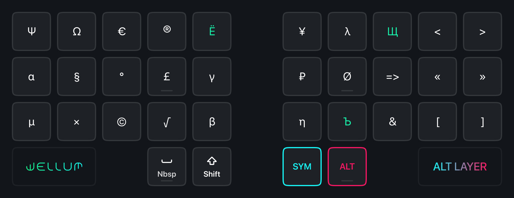
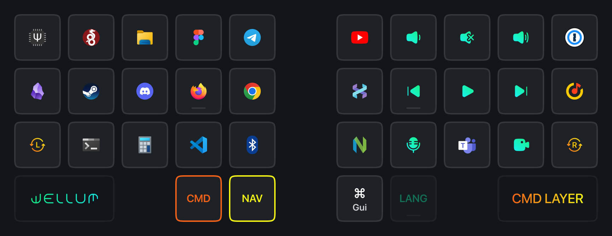
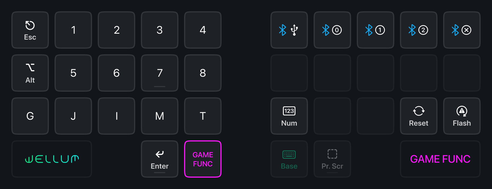

# [Wellum](./README.md) для 34 клавиш

- [Базовый слой](#базовый-слой)
- [Символы](#символы)
- [Навигация](#навигация)
- [Цифры и F-клавиши](#цифры-и-f-клавиши)
- [Специальные символы](#специальные-символы)
- [Команды и макросы](#команды-и-макросы)
- [Игровой слой](#игровой-слой)

## Клавиатурные слои

- Удерживай <kbd>SYM</kbd> чтобы активировать слой символов.
- Удерживай <kbd>NAV</kbd> чтобы активировать слой навигации.
- Удерживай <kbd>SYM</kbd> и <kbd>ALT</kbd> вместе, чтобы активировать слой спец. символов.
- Удерживай <kbd>SYM</kbd> и <kbd>NAV</kbd> вместе, чтобы активировать слой с цифрами.
- Удерживай <kbd>NAV</kbd> и <kbd>CMD</kbd> вместе, чтобы активировать слой команд.

## Базовый слой

> [!NOTE]
> Не волнуйтесь! Буквы `Ё`, `Ъ` и `Щ` находятся в [ALT слое](#специальные-символы).

## Символы

## Навигация

На левой половинке расположены <kbd>Game Layer</kbd>, <kbd>Print Screen</kbd> и различные макросы:

|               Клавиша | Макрос                                                                                                                     |
| --------------------: | :------------------------------------------------------------------------------------------------------------------------- |
|   <kbd>SWAP WIN</kbd> | <kbd>Alt</kbd> + <kbd>Tab</kbd>, [Swapper](./README.md#как-работает-swapper-и-tabber) (для окон в Windows/Linux)           |
|   <kbd>SWAP MAC</kbd> | <kbd>Gui</kbd> + <kbd>Tab</kbd>, [Swapper](./README.md#как-работает-swapper-и-tabber) (для окон в macOS)                   |
|   <kbd>SWAP TAB</kbd> | <kbd>Ctrl</kbd> + <kbd>Tab</kbd>, [Tabber](./README.md#как-работает-swapper-и-tabber) (для вкладок в браузере и терминале) |
| <kbd>Prev Space</kbd> | <kbd>Ctrl</kbd> + <kbd>Gui</kbd> + <kbd>Left</kbd>                                                                         |
| <kbd>Next Space</kbd> | <kbd>Ctrl</kbd> + <kbd>Gui</kbd> + <kbd>Right</kbd>                                                                        |

На правой половинке расположены vim-подобные стрелочки, Home/End (сверху) и Page Up/Down (снизу).

Клавиши <kbd>Escape</kbd>, <kbd>Enter</kbd> и <kbd>Tab</kbd> продублированы на обеих половинках, что удобно при в различных программах и редакторах, где только левая рука находится на клавиатуре, а правая на мыши.

> Так как BIOS или система, на которой не установлена [Universal Layout](https://github.com/braindefender/universal-layout), сопоставляют клавиши и символы стандартным способом, то для совместимости, на слое NAV расположена клавиша `KC_QUOT`, на которой обычно расположены одиночная и двойная кавычки. Это может пригодиться для RDP или, например, при правке конфигов в Live-USB режиме Linux.

## Цифры и F-клавиши

> Цифры в `NUM` слое являются клавишами Numpad'а, поэтому для корректной работы он должен быть включён!

## Специальные символы

В слой вынесены русские буквы, которые не влезли в 2×15 сетку, а также различные символы, многие из которых расположены мнемонически:

|       Символ | Способ ввода                  |
| -----------: | :---------------------------- |
| <kbd>Ё</kbd> | <kbd>Alt</kbd> + <kbd>Е</kbd> |
| <kbd>Ъ</kbd> | <kbd>Alt</kbd> + <kbd>Ь</kbd> |
| <kbd>Щ</kbd> | <kbd>Alt</kbd> + <kbd>Ш</kbd> |
| <kbd>₽</kbd> | <kbd>Alt</kbd> + <kbd>Р</kbd> |

На месте **пробела** расположен символ **неразрывного пробела** (NBSP), который заставляет делать перенос текста только вместе с соседними от него словами.

Символы `<` `>` `«` `»` `[` `]` и лигатура `=>`, удобная для разработчиков, также доступны в `ALT` слое для обеих языков.

## Команды и макросы

Этот слой содержит медиа-клавиши, расположенные на правой половине. Все остальные клавиши являются MEH+Key, то есть отправляют сочетание <kbd>Ctrl</kbd>+<kbd>Shift</kbd>+<kbd>Alt</kbd>+<kbd>Key</kbd>. Для совсем упоротых сочетаний, содержащих <kbd>Gui</kbd> на правой половине она присутствует на правом пальце.

> Иконки приложений и команд даны для примера. Выбор способа связи клавиш MEH+Key остаётся за вами.

## Игровой слой

WASD смещён на одну колонку вправо, чтобы вместить <kbd>Tab</kbd>, <kbd>Shift</kbd> и <kbd>Ctrl</kbd> на почти привычных позициях. Для эргономичных клавиатур это также актуально из-за смещения клавиш по вертикали, где клавиша под средний палец находится выше всего.

Также, в слое с цифрами помещается два ряда цифр и часто используемые в играх клавиши:

|      Клавиша | Описание  |
| -----------: | :-------- |
| <kbd>G</kbd> | Grenade   |
| <kbd>J</kbd> | Journal   |
| <kbd>I</kbd> | Inventory |
| <kbd>M</kbd> | Map       |
| <kbd>T</kbd> | Chat      |
