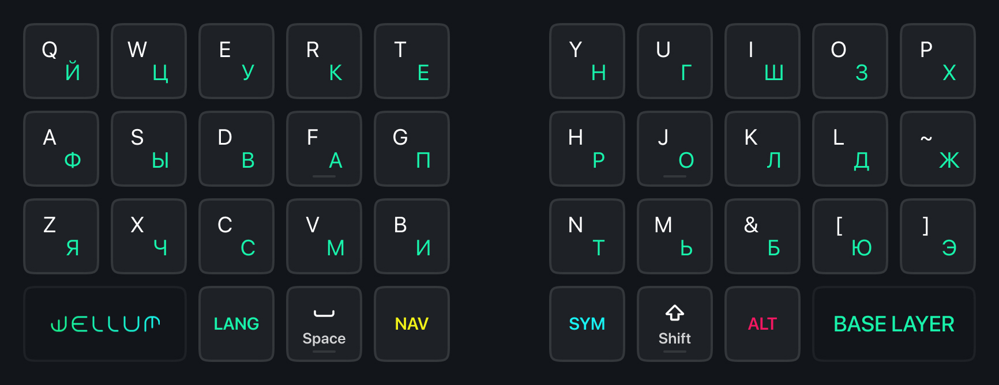
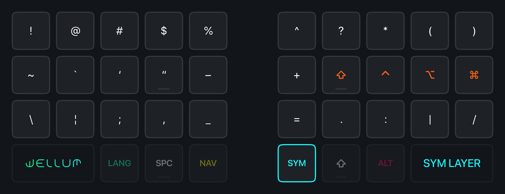
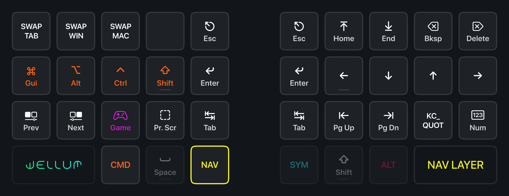
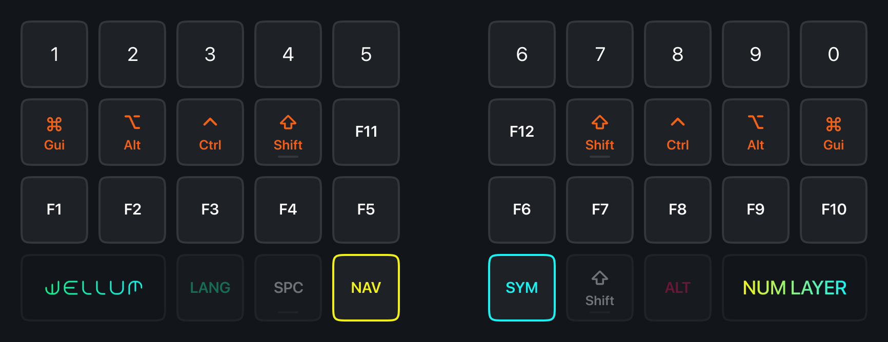
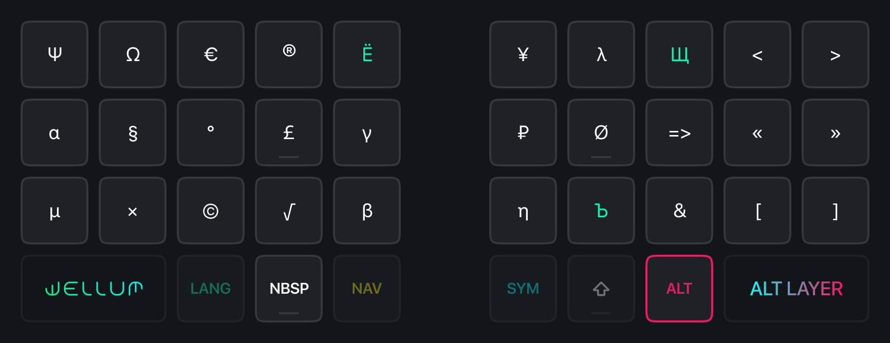
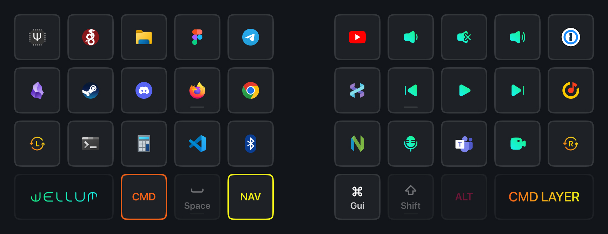
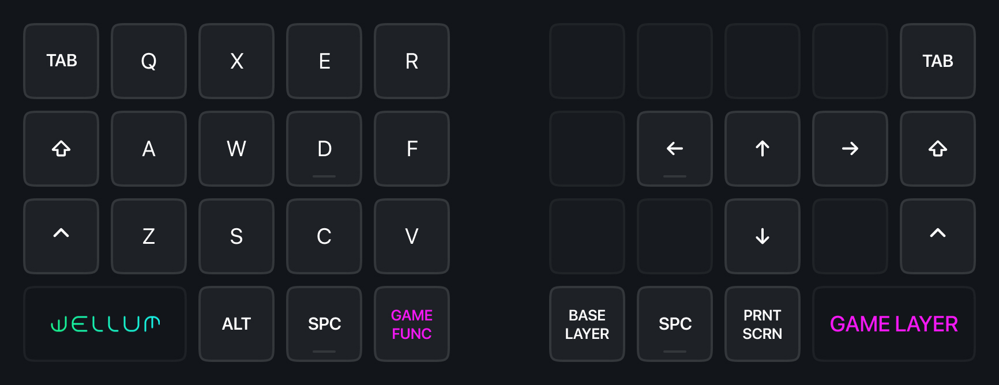
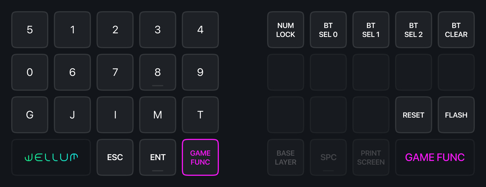

# [Wellum](./README.md) for 36 keys

- [Base Layer](#base-layer)
- [Symbols](#symbols)
- [Navigation](#navigation)
- [Numbers and F-Keys](#numbers-and-f-keys)
- [Special Symbols](#special-symbols)
- [Commands and Macros](#commands-and-macros)
- [Gaming Layer](#gaming-layer)

## Keyboard Layers

- Hold <kbd>SYM</kbd> to activate the symbols layer.
- Hold <kbd>NAV</kbd> to activate the navigation layer.
- Hold <kbd>ALT</kbd> to activate the special symbols layer.
- Hold <kbd>SYM</kbd> and <kbd>NAV</kbd> together to activate the numbers layer.
- Hold <kbd>NAV</kbd> and <kbd>CMD</kbd> together to activate the commands layer.

## Base Layer

> [!NOTE]
> Don't worry! The letters `Ё`, `Ъ`, and `Щ` are in the [ALT layer](#special-symbols).

## Symbols

## Navigation

On the left half are <kbd>Game Layer</kbd>, <kbd>Print Screen</kbd>, and various macros:

|                   Key | Macro                                                                                                                  |
| --------------------: | :--------------------------------------------------------------------------------------------------------------------- |
|   <kbd>SWAP WIN</kbd> | <kbd>Alt</kbd> + <kbd>Tab</kbd>, [Swapper](./README.md#how-swapper-and-tabber-work) (for windows in Windows/Linux)     |
|   <kbd>SWAP MAC</kbd> | <kbd>Gui</kbd> + <kbd>Tab</kbd>, [Swapper](./README.md#how-swapper-and-tabber-work) (for windows in macOS)             |
|   <kbd>SWAP TAB</kbd> | <kbd>Ctrl</kbd> + <kbd>Tab</kbd>, [Tabber](./README.md#how-swapper-and-tabber-work) (for tabs in browser and terminal) |
| <kbd>Prev Space</kbd> | <kbd>Ctrl</kbd> + <kbd>Gui</kbd> + <kbd>Left</kbd>                                                                     |
| <kbd>Next Space</kbd> | <kbd>Ctrl</kbd> + <kbd>Gui</kbd> + <kbd>Right</kbd>                                                                    |

On the right half are vim-like arrows, Home/End (at the top) and Page Up/Down (at the bottom).

The <kbd>Escape</kbd>, <kbd>Enter</kbd>, and <kbd>Tab</kbd> keys are duplicated on both halves, which is convenient in various programs and editors where only the left hand is on the keyboard and the right hand is on the mouse.

> Since BIOS or the system where [Universal Layout](https://github.com/braindefender/universal-layout) is not installed maps keys and symbols in the standard way, for compatibility, the NAV layer has the `KC_QUOT` key, which usually has single and double quotes. This can be useful for RDP or, for example, when editing configs in Live-USB Linux mode.

## Numbers and F-Keys

> The numbers in the `NUM` layer are Numpad keys, so for correct operation, it must be enabled!

## Special Symbols

The layer contains Russian letters that didn't fit into the 2×15 grid, as well as various symbols, many of which are placed mnemonically:

|       Symbol | Input Method                  |
| -----------: | :---------------------------- |
| <kbd>Ё</kbd> | <kbd>Alt</kbd> + <kbd>Е</kbd> |
| <kbd>Ъ</kbd> | <kbd>Alt</kbd> + <kbd>Ь</kbd> |
| <kbd>Щ</kbd> | <kbd>Alt</kbd> + <kbd>Ш</kbd> |
| <kbd>₽</kbd> | <kbd>Alt</kbd> + <kbd>Р</kbd> |

In place of the **space** is the **non-breaking space** (NBSP) symbol, which forces text wrapping only together with neighboring words.

Symbols `<` `>` `«` `»` `[` `]` and the ligatures `=>` and `->`, convenient for developers, are also available in the `ALT` layer for both languages.

## Commands and Macros

This layer contains media keys located on the right half. All other keys are MEH+Key, meaning they send the combination <kbd>Ctrl</kbd>+<kbd>Shift</kbd>+<kbd>Alt</kbd>+<kbd>Key</kbd>. For really crazy combinations containing <kbd>Gui</kbd>, on the right half it is present on the right finger.

> App icons and commands are given as examples. The choice of how to bind MEH+Key keys is up to you.

## Gaming Layer

WASD is shifted one column to the right to fit <kbd>Tab</kbd>, <kbd>Shift</kbd>, and <kbd>Ctrl</kbd> in almost familiar positions. For ergonomic keyboards, this is also relevant due to the vertical shift of keys, where the key under the middle finger is the highest.

Also, in the numbers layer there are two rows of numbers and frequently used keys in games:

|          Key | Description |
| -----------: | :---------- |
| <kbd>G</kbd> | Grenade     |
| <kbd>J</kbd> | Journal     |
| <kbd>I</kbd> | Inventory   |
| <kbd>M</kbd> | Map         |
| <kbd>T</kbd> | Chat        |
